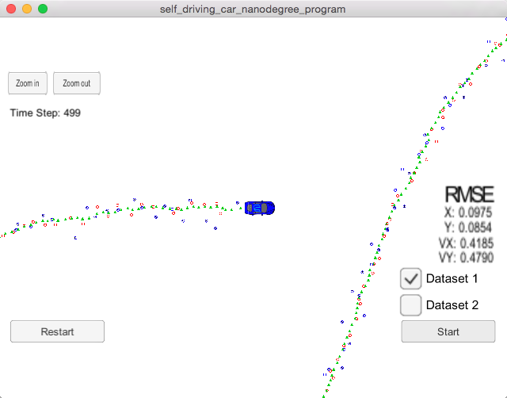

# Extended Kalman Filters

## 1. Compiling


This repository includes two files that can be used to set up and intall [uWebSocketIO](https://github.com/uWebSockets/uWebSockets) for my Mac systems. 

```bash
sh ./install-mac.sh
```

Once the install for uWebSocketIO is complete, the main program can be built and ran by doing the following from the project top directory.

```bash
mkdir build
cd build
cmake ..
make
./ExtendedKF
```

Next, I written my code on files in the src folder:

```
src
├── Eigen
├────......(cp -r Eigen files here)
├── FusionEKF.cpp
├── FusionEKF.h
├── json.hpp
├── kalman_filter.cpp
├── kalman_filter.h
├── main.cpp
├── measurement_package.h
├── tools.cpp
└── tools.h

```

## 2.Accuracy

Finally, my code could get the RMSE values for [0.0975, 0.0854, 0.4185, 0.4790], which just satisfied the requirement:

> Your px, py, vx, and vy RMSE should be less than or equal to the values [.11, .11, 0.52, 0.52].

Image of final RMSE for dataset1.




## 3.Follows the Correct Algorithm

### 3.1.Your Sensor Fusion algorithm follows the general processing flow as taught in the preceding lessons.

Yes, I just followed the instrucions in the preceding lessons because I did not change the structure of the start code.

The workflow for the algorithm is like this:


### 3.2. Your Kalman Filter algorithm handles the first measurements appropriately.

Of course I made that and I got a good RMSE finally.

### 3.3. Your Kalman Filter algorithm first predicts then updates.

Of course I made that and I got a good RMSE finally.

### 3.4. Your Kalman Filter can handle radar and lidar measurements.

Of course I made that and I got a good RMSE finally.

Besides, some efforts were made mainly in aspects including:

#### 3.4.1. Only update px and py for Lidar data

In `src/FusionEKF.cpp`, I tried to update all four measurements in line 198, but I found that it would be more accurate when only `px` and `py` were update:

```c
z << measurement_pack.raw_measurements_[0], measurement_pack.raw_measurements_[1];
```

#### 3.4.2. Avoiding division by zero:

On the one hand, in `src/tools.cpp`, line 52-60, function `CalculateJacobian`, if the denominator `px*px+py*py` is too close to zero, the `Hj` would be set to zeros:

```c
float under2 = px * px + py * py;
float under1 = sqrt(under2);
float under3 = (under2 * under1);
    
//check division by zero
if (fabs(under2) < 0.0001) {
	cout << "CalculateJacobian () - Error - Division by Zero" << endl;
	return Hj_.setZero();
}
    
```
On the other hand, in `src/kalman_filter.cpp`, line 66-76, function `UpdateEKF`, if the `px` or `ro` is too close to zero, a small value (0.0001) would be set in order to avoiding zero while dividing:

```c
//avoiding division by zero
if (fabs(px) < 0.0001){
	px = 0.0001;
}
    
if (fabs(ro) < 0.0001) {
	ro = 0.0001;
}
    
float theta  = atan(py/px);
float ro_dot = (vx*px+vy*py) / ro;
```

#### 3.4.3. Normalizing Angles:

As was mentioned in the tips section in the courses:

>In C++, atan2() returns values between -pi/2 and pi/2.When calculating phi in y = z - h(x) for radar measurements, the resulting angle phi in the y vector should be adjusted, so that it is between -pi/2 and pi/2. The Kalman filter is expecting small angle values between the range -pi/2 and pi/2. So when working in radians, I just add π or subtract π until the angle is within the desired range.

Firstly I just followed this instruction in `src/FusionEKF.cpp`, line 174-179, function `ProcessMeasurement`:

```c
while(z(1) > PI/2){
    z(1) -= PI;
}
while(z(1) < -1 * PI/2){
	z(1) += PI;
}
```

Then I found that the corrected value of theta could be -89, and the measurment value could be 88, which would introduce a big error(88-(-89)=177). However, this error value is just 2 degree in fact because -89 is just like 91(88-91=-2). So I fixed this bug in `src/kalman_filter.cpp` line 79-85, function `UpdateEKF`:

```c
//avoiding something like theta=-89 and z(1) = 89
if (theta-z(1) > 0.9*PI){
	theta -= PI;
}
if (theta-z(1) < -0.9*PI){
	theta += PI;
}
```

## 4. Code Efficiency

### 4.1. Your algorithm should avoid unnecessary calculations.

I thought I did that, so I really need some suggestions from the reviewer. Thanks!